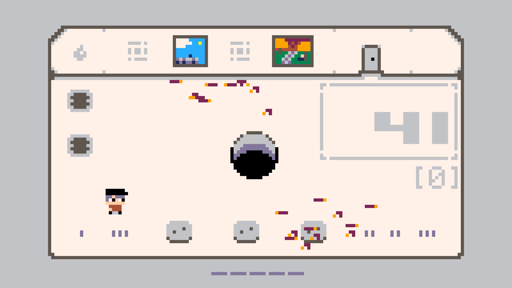
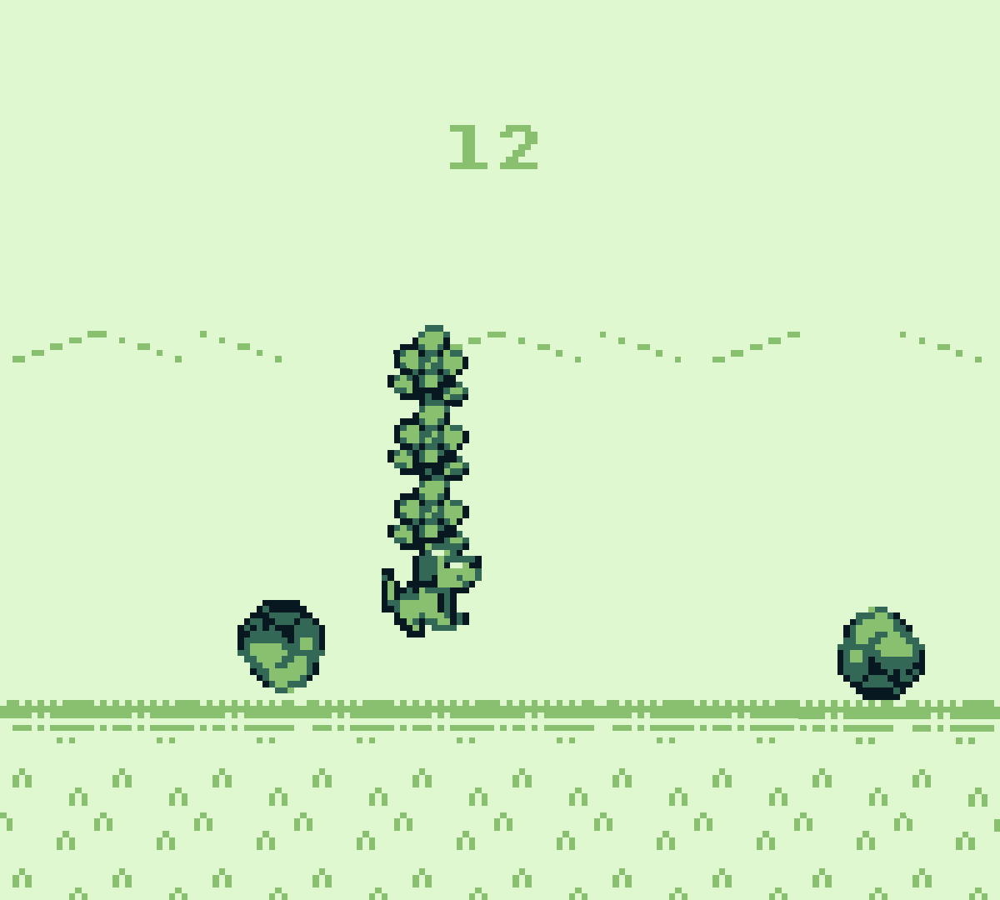
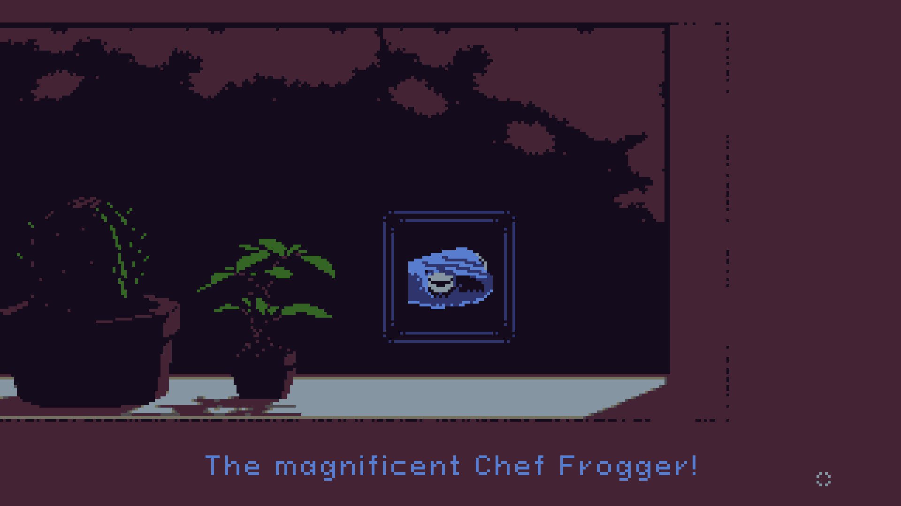

Building games should be fun.
At some point, it stopped feeling that way for me.
And well, if it's not fun, why bother?
Maybe adhering to dogma is a reason for some, but I am not that kind of person.

My primary workflow used to revolve around the [Godot Engine](https://godotengine.org/) and its scripting language.
It was a great fit for my needs, 2D games with a retro feel, but there was always a little bit of friction.
Some of that was me wanting something different, and the rest was Godot shifting toward a more opinionated, editor-driven design.
Eventually, that friction grew with new Godot releases, leading me to where I am now: developing my own game engine in D called [Parin](https://github.com/Kapendev/parin).

Of course, Parin was not my first attempt at game development outside of Godot.
My initial goal was to see if I could create a workflow that felt as nice as the one I was used to.
That led me on a long detour through languages like Nim, Go, Rust, and C.
I even tried D once before eventually going back to it and realizing it was exactly what I needed.
It's a pragmatic and unopinionated language that simply gets out of my way.

In this blog, I'll go over some features of D that I like and how I use them to make games.
The TL;DR is:

- Using D for everything.
- Fast compile times under 1 second.
- The freedom to choose the best memory allocation strategy.
- Achieving C-like speed with a much cleaner developer experience.

*Game Made with Parin: [Worms Within](https://kapendev.itch.io/worms-within)*


## Memory Management

D's unopinionated approach is most evident in the control it gives me over memory.
In Parin, I've structured the code so that it avoids the garbage collector by default.
It instead relies primarily on static data structures and an arena allocator that is cleared at the end of every frame.

To keep things flexible, many data structures take a compile-time argument to toggle between static or dynamic allocation.
The engine uses the static versions because they allow me to easily bundle different types of data into a single block of memory and avoid runtime allocations.

Here is an example of how that looks in practice:

```d
// A list with a dynamic capacity.
struct List(T) {
    T[] items;
    int capacity;
}

// A list with a fixed capacity.
struct FixedList(T, int N) {
    T[N] items;
    enum capacity = N;
}

// A 2D grid. Type `D` defines its behavior.
struct Grid(T, D = List!T) {
    D tiles;
    int rowCount;
    int colCount;
}

// A static grid type.
alias TileMap = Grid!(short, FixedList!(short, 128 * 128));
```

This in general provides a nice performance boost, yet the code remains as readable as it would be in any high-level language.

For the parts that require dynamic allocation, the engine provides two paths.
It sometimes accepts user-allocated memory, meaning a user can decide exactly what kind of memory (GC, malloc, or stack) they want to use.
For everything else, it uses a "nogc" utility library I wrote called [Joka](https://github.com/Kapendev/joka).
Memory allocated through Joka has to be freed manually.

A lot of programming languages would stop you right there, by making you pick a main memory management strategy for a project and allowing limited support for other ones.
But D is different and will let you do almost everything.

While Joka is designed for manual memory management, it includes a `JokaGcMemory` version flag.
When this is defined, the library's default memory allocations switch at compile time to using the garbage collector.
Even in this setup, it is still possible to manage memory manually at runtime because Joka provides an allocator API for fine-grained control.
What this flag does in practice is simply replace the default allocator used by every Joka (and Parin) function.
In D, GC pointers have the same type as any other pointer, so things continue to work out of the box when changing the defaults.

Below is the allocator API for Joka:

```d
struct MemoryContext {
    void* allocatorState;
    AllocatorReallocFunc reallocFunc;
    AllocatorFreeFunc freeFunc;
}

alias AllocatorReallocFunc = void* function(void* allocatorState, size_t alignment, void* oldPtr, size_t oldSize, size_t newSize, const(char)[] file, size_t line);
alias AllocatorFreeFunc    = void  function(void* allocatorState, size_t alignment, void* oldPtr, size_t oldSize, const(char)[] file, size_t line);
```

It's a simple allocator API that works for my needs.
I know D includes an experimental one in the standard library, but I made my own to learn how they work.
I also have a bit of a "Not Invented Here" problem sometimes, so there's that.
We are just having fun here.

An example of allocators in action:

```d
import joka;

void main() {
    ubyte[1024] buffer = void;
    auto arena = Arena(buffer);
    auto i = 0;
    // Use the arena to allocate memory for the numbers.
    auto numbers = List!int(arena.toMemoryContext(), 1, 2, 3);
    assert(numbers[i++] == 1);
    assert(numbers[i++] == 2);
    assert(numbers[i++] == 3);
}
```


To mitigate some memory bugs when `JokaGcMemory` is not enabled, Joka tracks all allocations in debug builds.
Parin is set up to provide immediate feedback using that information if someone forgets to free memory or attempts an invalid free.
This works because the allocator API requires a file and line argument for everything it does.

The reports look like this:

```d
Memory Leaks: 4 (total 668 bytes, 5 ignored)
  1 leak, 20 bytes, source/app.d:24
  1 leak, 53 bytes, source/app.d:31
  2 leak, 32 bytes, source/app.d:123
```

The tracking system also includes features like grouping allocations and ignoring leaks, so the output is less noisy.
It's not a 100% solution, but it covers many practical cases.
For the kind of code I write, I prefer this simpler approach over smart pointer abstractions.

There is one last thing both Joka and Parin can do with memory: changing the allocator used inside a scope implicitly.
So if I have a function allocating things dynamically, I can "intercept" it and force it to allocate things on the stack, for example.
It's a niche feature for exceptional cases and a thread-local variable called `__memoryContext` is what makes it work.

Here is an example of managing that thread-local variable via a RAII helper called `ScopedMemoryContext`:

```d
import joka;

void main() {
    ubyte[1024] buffer = void;
    auto arena = Arena(buffer);
    auto i = 0;
    // Use the arena to allocate memory for everything inside the `with` block.
    // `ScopedMemoryContext` automatically restores the previous context when exiting this block.
    with (ScopedMemoryContext(arena)) {
        auto numbers = List!int(1, 2, 3);
        assert(numbers[i++] == 1);
        assert(numbers[i++] == 2);
        assert(numbers[i++] == 3);
    }
}
```

I'm not the biggest fan of this approach because it can make things harder to reason about if overused.
At least, that is my experience with languages that provide a built-in way of doing it.
In my opinion it's much simpler to pass allocators explicitly because it describes the allocator usage better on the function level.
Of course, this is not always possible and that's why this exists.
To keep things clean, my library code avoids touching this variable and it is strictly a user-side option.

All this combined (and it's a lot) gives me the choice to keep manual control, let D handle everything, or use a combination of both.
I can pick the best solution for a project without the compiler complaining about why I am doing things the "wrong" way.
Well, D has some features that do enforce strictness, the [`@nogc`](https://dlang.org/spec/function.html#nogc-functions) attribute for example, but both Joka and Parin use those only when they don't introduce extra friction.
None of my libraries support `@nogc` fully and that is by design, even though in theory they could; a combination of that attribute alongside the `-vgc` flag has been working well instead.

While mixing allocation strategies like this might sound weird to anyone used to a "one or the other" approach, I've found plenty of use cases for it, especially when collaborating.
When I'm working with people who aren't comfortable with manual memory management, or the game doesn't have strict constraints, I can simply tell them to use the garbage collector while I focus on the low-level parts.
The engine supports mixing both workflows in the same project, providing a setup similar to a C++ and Lua combination, but without the cross-language cost.

One other use case for mixing GC and non-GC code is the tracking system mentioned earlier.
Yes, it's "secretly" using the garbage collector!
I just offload all of the work to it instead of worrying about allocations that don't matter to my program's performance.
It's debug-only code at the end of the day, so who cares if it uses the garbage collector or not?
That code is stripped out in release builds anyway.

I think I covered almost everything I do with memory in D.
Might have missed one thing, but the point still stands.
Having this level of control without fighting the language is awesome!

## Metaprogramming

Metaprogramming is something I'm not good at, but I do enjoy it sometimes.
D does a great job of providing a smooth experience for it because it feels like writing regular code instead of a different language.
One of my use cases is building entity systems.
While Parin doesn't force a specific entity system on you, it provides a tagged union that makes building one straightforward.

It looks like this:

```d
alias UnionType = ubyte;

struct Union(A...) if (A.length != 0) {
    union UnionData {
        // Creates the fields of the raw union.
        static foreach (i, T; A) {
            mixin("T _m", i.stringof, ";");
        }
    }

    UnionData _data;
    UnionType _type;
}

// An example of a union that holds two types.
alias Entity = Union!(Marion, Goomban);
struct Marion  { float x, y; int hp; }
struct Goomban { float x; }
```

The real type includes some extra information about its fields, which allows for safety checks at compile time.
I personally use a [`static assert`](https://dlang.org/spec/version.html#static-assert) in my games to ensure that every type in the tagged union shares the same first field, the "base" of the union as I call it.
This makes sure that I can safely access shared data (like position or size) without needing to manually check the active union type at runtime.

For example:

```d
// This guarantees that accessing '.base' of `Entity` is always safe.
static assert(Entity.isBaseAliasingSafe);

// Access the base shared by all types and move everything to the right.
foreach (ref e; entities.items) e.base.x += 32;
```

To handle specific logic for different types, I use a templated function named `call`.
This generates a large `switch` statement that calls the correct method for the currently active type.

An example of using the `call` function:

```d
// Automatically calls 'update' and 'draw' for the underlying type.
foreach (ref e; entities.items) e.call!"update"(dt);
foreach (ref e; entities.items) e.call!"draw"();
```

Since everything happens at compile time, the compiler will give clear error messages if a method is missing.
This can be combined with D's [`alias this`](https://p0nce.github.io/d-idioms/#Extend-a-struct-with-alias-this) feature to provide default implementations for types that lack the needed methods.
Below is a simplified example of what an entity type looks like in practice:

```d
import parin;

// The base type of every entity.
struct EntityBase {
    Rect body;

    // The default implementations.
    void update(float dt) {}
    void draw() {}
}

// Actor is a type of entity.
struct Actor {
    EntityBase base;
    alias base this;

    // Custom draw logic.
    void draw() {
        // `body` is part of `EntityBase`.
        drawRect(body, orange);
        drawText("Actor", body.position);
    }
}
```

This approach keeps my code clean and avoids the common "mega struct" pattern where every entity property is crammed into one space-inefficient object.
A [complete example](https://github.com/Kapendev/parin/blob/main/examples/basics/_018_entity.d) of the tagged union is available in the Parin repo.

Moving away from game logic, the same kind of compile-time introspection is quite handy for building developer tools.
Since the code can look at a struct and see every member inside it, I can write functions that automatically generate UI elements for those members.
In Parin, I have a helper called `headerAndMembers` that I use to build debug windows for any game object:

```d
import parin, parin.addons.microui;

Game game;

struct Game {
    int width = 50;
    int height = 50;
    IVec2 point = IVec2(70, 50);
}

// Called once when the game starts.
void ready() {
    readyUi(engineFont, 2);
}

// Called every frame while the game is running.
bool update(float dt) {
    drawRect(Rect(game.point.x, game.point.y, game.width, game.height));
    beginUi();
    if (beginWindow("Edit", UiRect(500, 80, 350, 370))) {
        headerAndMembers(game, 125);
        endWindow();
    }
    endUi();
    return false;
}

// Creates a main function that calls the given functions.
mixin runGame!(ready, update, null);
```

Instead of manually writing a line of UI code for every single member I want to tweak, I let the compiler handle it.
If I add a new variable to my game state, it simply appears in the editor the next time I run the game.
To customize this further, I can also use [user-defined attributes (UDAs)](https://dlang.org/spec/attribute.html#uda) to control how things look.
For example, applying `@UiMember("Cool Name")` to a variable will override its display name in the editor.

Another interesting thing I do with metaprogramming is joint allocations.
This is the practice of allocating multiple arrays in a single contiguous block of memory to improve cache locality and reduce allocator overhead.
While you can do this manually, D's introspection allows for a much more elegant and safe solution.

A small example:

```d
import joka, std.stdio;

struct Ve2 { float x, y; }
struct Ve3 { float x, y, z; }

struct Mesh {
    Ve3[] positions;
    int[] indices;
    Ve2[] uvs;

    this(int positionsLength, int indicesLength, int uvsLength) {
        // `jokaMakeJoint` calculates the total size and offsets for all arrays
        // and performs a single allocation.
       this = jokaMakeJoint!Mesh(positionsLength, indicesLength, uvsLength);
    }

    void free() {
        // The first slice has the pointer that needs to be freed.
        jokaFree(this.tupleof[0].ptr);
    }
}

void main() {
    auto mesh = Mesh(4, 6, 4);
    writeln("Positions:\n ", mesh.positions);
    writeln("Indices:\n ", mesh.indices);
    writeln("UVs:\n ", mesh.uvs);
    mesh.free();
}
```

In the `free` method above, I use the [`tupleof`](https://dlang.org/spec/property.html#tupleof) property.
In D, this allows you to access the fields of a struct as a sequence.
Since `jokaMakeJoint` allocates one big block and points the first field to the start of it, freeing `this.tupleof[0].ptr` (the pointer of the first slice, `positions`) effectively frees the entire memory block.

These are simple things, but combined they make my code simpler.

## Compile Times

I was a bit concerned about losing the fast iteration loops I enjoyed in Godot.
However, D's compile times are really fast.
On an older Ryzen 3 2200G running Ubuntu, my games compile in around 0.6 seconds without using a build system.

They can go down to roughly 0.4 seconds when using the `-betterC -i` flags.
My libraries do support [`-betterC`](https://dlang.org/spec/betterc.html), but I generally don't recommend it for most cases since it removes the D runtime and some of its conveniences.
It is primarily useful when building for targets like the web, where minimizing dependencies simplifies the build.
Web builds can also use the normal runtime, but they require a slightly different setup.

Overall, fast code and fast compile times.
It’s kinda crazy that those times include all of the cool metaprogramming things mentioned earlier.

*Game Made with Parin: [Runani](https://kapendev.itch.io/runani)*


## Workflow

Because of the fast compile times and the helpful standard library (which I haven't mentioned until now), I also use D as a scripting language.
The script that creates web builds for my games is written entirely in D.
It handles packaging, asset copying, and the configuration needed for the web target.
Instead of maintaining separate scripts for different platforms, I use one language everywhere and it works fine.

An example of using the web script with [DUB](https://dub.pm/):

```sh
dub run parin:web
```

The same idea is used for a small setup script for DUB projects.
It generates the folders and files I usually want when starting a new game.
One of them is an `app.d` file containing a basic hello-world program.
The script can also include a minimal entity system by passing a flag to it called `entity`.

An example of using the setup script with DUB:

```sh
dub init -t parin -- entity
```

The bottom line is that the workflow is simple.
When I need automation or tooling, I just write more D.
I still use shell and batch scripts when it makes sense, but most projects don't really need them.

## Moving On

I think I said a lot of nice things about D already, so I will stop here.
The main point of everything is not to say that I use D to save the world or to participate in language wars.
I just wanted to stop fighting my tools and get back to making games.
That is the important part.

Parin and Joka are still a work in progress and I'm definitely still figuring things out as I go.
But for now, the friction is gone, I'm having fun, and I'm actually finishing projects again.
That's enough of a win for me.

## Get Involved

And this... is the end.
I'm Alexandros F. G. Kapretsos, a game developer and Economics student at AUEB.
If you enjoyed this, feel free to check out my work:

- Check [Parin](https://github.com/Kapendev/parin) and [Joka](https://github.com/Kapendev/joka) on GitHub.
- Take a look at [microui-d](https://github.com/Kapendev/microui-d), my rewrite of [rxi's microui](https://github.com/rxi/microui) with texture support and other D-specific improvements. [Parin comes with it out of the box](https://github.com/Kapendev/parin/blob/main/examples/integrations/microui.d)!
- See the engine in action by playing my games on [kapendev.itch.io](https://kapendev.itch.io/).
- Read my personal rants about game development on [dev.to/kapendev](https://dev.to/kapendev).

*Game Made with Parin: [A Short Metamorphosis](https://kapendev.itch.io/a-short-metamorphosis)*

